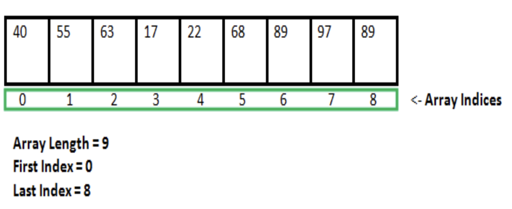
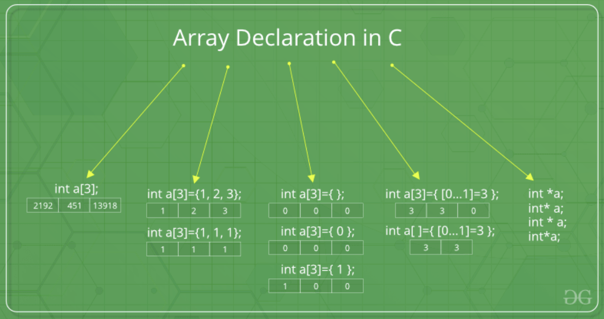
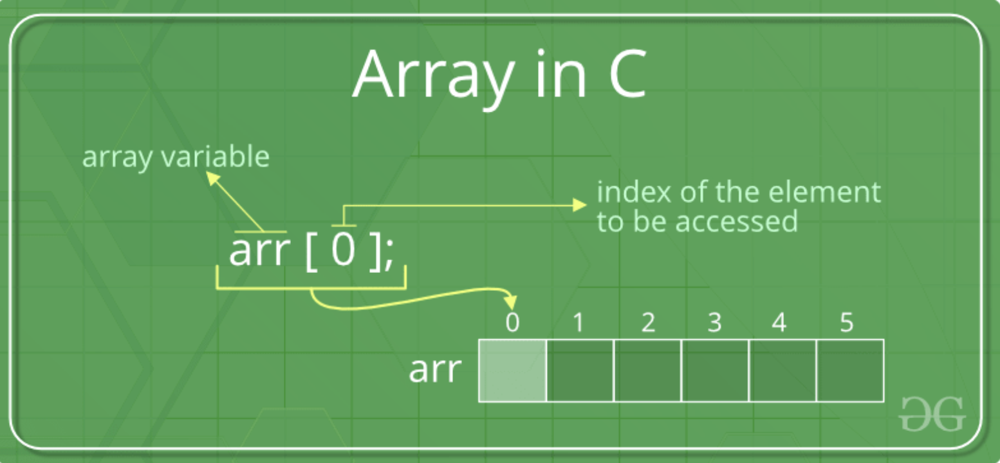

# Lab 6:  Array and Vector in C++

Welcome to the six session of  CSC 200 lab! This will familiarize you with using Array and Vectors as well as give you some experience in their proper use. **Be sure to read and follow all instructions unless otherwise specified.**  You'll find the table of contents for this lab below.

1. [Array in C++](#part-1-Array_in_C++)
4. [Vectors in C++ ](#part-2-Vectors in C++)
3. [Exercises](#part-3-exercises)

## Part 1. Array in C++

An array in C/C++ or be it in any programming language is a collection of similar data items stored at contiguous memory locations and elements can be accessed randomly using indices of an array.  They can be used to store collection of primitive data types such as int, float, double, char, etc of any particular type. To add to it, an array in C/C++ can store derived data types such as the structures, pointers etc. Given below is the picture representation of an array.


**Why do we need arrays?** 
We can use normal variables (v1, v2, v3, ..) when we have a small number of objects, but if we want to store a large number of instances, it becomes difficult to manage them with normal variables. The idea of an array is to represent many instances in one variable.


**Array declaration in C++:** 




There are various ways in which we can declare an array. It can be done by :

1. specifying its type and size,

2. specifying its type and size and initializing it.

   

#### **Array declaration by specifying size**

```C++
// Array declaration by specifying size
int arr1[10];

// With recent C/C++ versions, we can also
// declare an array of user specified size
int n = 10;
int arr2[n];
```


#### **Array declaration by specifying size**

```C++
// Array declaration by initializing elements
int arr[] = { 10, 20, 30, 40 }

// Compiler creates an array of size 4.
// above is same as "int arr[4] = {10, 20, 30, 40}"
```


#### **Array declaration by specifying size and initializing elements**

```c++
// Array declaration by specifying size and initializing
// elements
int arr[6] = { 10, 20, 30, 40 }

// Compiler creates an array of size 6, initializes first
// 4 elements as specified by user and rest two elements as
// 0. above is same as "int arr[] = {10, 20, 30, 40, 0, 0}"
```


**Advantages of an Array in C++:** 

1. Random access of elements using array index.
2. Use of fewer line of code as it creates a single array of multiple elements.
3. Easy access to all the elements.
4. Traversal through the array becomes easy using a single loop.
5. Sorting becomes easy as it can be accomplished by writing fewer line of code.


**Disadvantages of an Array in C++:** 

1. Allows a fixed number of elements to be entered which is decided at the time of declaration so an array in C/C++ is not dynamic.

2. Insertion and deletion of elements can be costly since the elements are needed to be managed in accordance with the new memory allocation.

   

**Accessing Array Elements:** 
Array elements are accessed by using an integer index. Array index starts with 0 and goes till size of array minus 1. Also, Name of the array is also a pointer to the first element of array.




Example:

```c++
#include <iostream>

int main()
{
	int arr[5];
	arr[0] = 5;
	arr[2] = -10;

	// this is same as arr[1] = 2
	arr[3 / 2] = 2;
	arr[3] = arr[0];

	std::cout << arr[0] << " " << arr[1] << " " << arr[2] << " "
		<< arr[3];

	return 0;
}
```

```c++
Output : 5 2 -10 5
```


**No Index Out of bound Checking:** 
There is no index out of bounds checking in C/C++, for example, the following program compiles fine but may produce unexpected output when run. 

```c++
// This C++ program compiles fine
// as index out of bound
// is not checked in C.

#include <iostream>

int main()
{
	int arr[2];

	std::cout << arr[3] << " ";
	std::cout << arr[-2] << " ";

	return 0;
}
```

```c++
Output : -449684907 4195777 
```


#### **The elements are stored at contiguous memory locations** 
**Example:** 

```c++
// C++ program to demonstrate that array elements
// are stored contiguous locations

#include <iostream>

int main()
{
	// an array of 10 integers.
	// If arr[0] is stored at
	// address x, then arr[1] is
	// stored at x + sizeof(int)
	// arr[2] is stored at x +
	// sizeof(int) + sizeof(int)
	// and so on.
	int arr[5], i;

	cout << "Size of integer in this compiler is "
		<< sizeof(int) << "\n";

	for (i = 0; i < 5; i++)
		// The use of '&' before a variable name, yields
		// address of variable.
		std::cout << "Address arr[" << i << "] is " << &arr[i]
			<< "\n";

	return 0;
}
```

```c++
Output:
Size of integer in this compiler is 4
Address arr[0] is 0x7ffe75c32210
Address arr[1] is 0x7ffe75c32214
Address arr[2] is 0x7ffe75c32218
Address arr[3] is 0x7ffe75c3221c
Address arr[4] is 0x7ffe75c32220
```


**Another way to traverse the array:**

```c++
#include<bits/stdc++.h>

int main()
{
	int arr[6]={11,12,13,14,15,16};
	// Way 1
	for(int i=0;i<6;i++)
		std::cout<<arr[i]<<" ";
	
std::cout<<endl;
	// Way 2
	std::cout<<"By Other Method:"<<endl;
	for(int i=0;i<6;i++)
		std::cout<<i[arr]<<" ";
	
	std::cout<<endl;

	return 0;
}
```


## Part 2. Vector  in C++

Vectors are same as dynamic arrays with the ability to resize itself automatically when an element is inserted or deleted, with their storage being handled automatically by the container. Vector elements are placed in contiguous storage so that they can be accessed and traversed using iterators. In vectors, data is inserted at the end. Inserting at the end takes differential time, as sometimes there may be a need of extending the array. Removing the last element takes only constant time because no resizing happens. Inserting and erasing at the beginning or in the middle is linear in time.

Certain functions associated with the vector are:
**Iterators**

1. [begin()](https://www.geeksforgeeks.org/vectorbegin-vectorend-c-stl/) – Returns an iterator pointing to the first element in the vector
2. [end()](https://www.geeksforgeeks.org/vectorbegin-vectorend-c-stl/) – Returns an iterator pointing to the theoretical element that follows the last element in the vector
3. [rbegin()](https://www.geeksforgeeks.org/vector-rbegin-and-rend-function-in-c-stl/) – Returns a reverse iterator pointing to the last element in the vector (reverse beginning). It moves from last to first element
4. [rend()](https://www.geeksforgeeks.org/vector-rbegin-and-rend-function-in-c-stl/) – Returns a reverse iterator pointing to the theoretical element preceding the first element in the vector (considered as reverse end)
5. [cbegin()](https://www.geeksforgeeks.org/vector-cbegin-vector-cend-c-stl/) – Returns a constant iterator pointing to the first element in the vector.
6. [cend()](https://www.geeksforgeeks.org/vector-cbegin-vector-cend-c-stl/) – Returns a constant iterator pointing to the theoretical element that follows the last element in the vector.
7. [crbegin()](https://www.geeksforgeeks.org/vectorcrend-vectorcrbegin-examples/) – Returns a constant reverse iterator pointing to the last element in the vector (reverse beginning). It moves from last to first element
8. [crend()](https://www.geeksforgeeks.org/vectorcrend-vectorcrbegin-examples/) – Returns a constant reverse iterator pointing to the theoretical element preceding the first element in the vector (considered as reverse end)


```c++
// C++ program to illustrate the
// iterators in vector
#include <iostream>
#include <vector>


int main()
{
	vector<int> g1;

	for (int i = 1; i <= 5; i++)
		g1.push_back(i);

	std::cout << "Output of begin and end: ";
	for (auto i = g1.begin(); i != g1.end(); ++i)
		std::cout << *i << " ";

	std::cout << "\nOutput of cbegin and cend: ";
	for (auto i = g1.cbegin(); i != g1.cend(); ++i)
		std::cout << *i << " ";

	std::cout << "\nOutput of rbegin and rend: ";
	for (auto ir = g1.rbegin(); ir != g1.rend(); ++ir)
		std::cout << *ir << " ";

	std::cout << "\nOutput of crbegin and crend : ";
	for (auto ir = g1.crbegin(); ir != g1.crend(); ++ir)
		std::cout << *ir << " ";

	return 0;
}
```

```c++
Output:
Output of begin and end: 1 2 3 4 5 
Output of cbegin and cend: 1 2 3 4 5 
Output of rbegin and rend: 5 4 3 2 1 
Output of crbegin and crend : 5 4 3 2 1
```

**Capacity**

1. [size()](https://www.geeksforgeeks.org/vectorempty-vectorsize-c-stl/) – Returns the number of elements in the vector.
2. [max_size()](https://www.geeksforgeeks.org/vector-max_size-function-in-c-stl/) – Returns the maximum number of elements that the vector can hold.
3. [capacity()](https://www.geeksforgeeks.org/vector-capacity-function-in-c-stl/) – Returns the size of the storage space currently allocated to the vector expressed as number of elements.
4. [resize(n)](https://www.geeksforgeeks.org/vector-resize-c-stl/) – Resizes the container so that it contains ‘n’ elements.
5. [empty()](https://www.geeksforgeeks.org/vectorempty-vectorsize-c-stl/) – Returns whether the container is empty.
6. [shrink_to_fit()](https://www.geeksforgeeks.org/vector-shrink_to_fit-function-in-c-stl/) – Reduces the capacity of the container to fit its size and destroys all elements beyond the capacity.
7. [reserve() ](https://www.geeksforgeeks.org/using-stdvectorreserve-whenever-possible/)– Requests that the vector capacity be at least enough to contain n elements.

```c++
#include <iostream>
#include <vector>


int main()
{
	vector<int> g1;

	for (int i = 1; i <= 5; i++)
		g1.push_back(i);

	std::cout << "Size : " << g1.size();
	std::cout << "\nCapacity : " << g1.capacity();
	std::cout << "\nMax_Size : " << g1.max_size();

	// resizes the vector size to 4
	g1.resize(4);

	// prints the vector size after resize()
	std::cout << "\nSize : " << g1.size();

	// checks if the vector is empty or not
	if (g1.empty() == false)
		std::cout << "\nVector is not empty";
	else
		std::cout << "\nVector is empty";

	// Shrinks the vector
	g1.shrink_to_fit();
	std::cout << "\nVector elements are: ";
	for (auto it = g1.begin(); it != g1.end(); it++)
		std::cout << *it << " ";

	return 0;
}
```

```c++
Output:
Size : 5
Capacity : 8
Max_Size : 4611686018427387903
Size : 4
Vector is not empty
Vector elements are: 1 2 3 4
```


**Element access:**

1. [reference operator [g\]](https://www.geeksforgeeks.org/vectoroperator-vectoroperator-c-stl/) – Returns a reference to the element at position ‘g’ in the vector
2. [at(g)](https://www.geeksforgeeks.org/vectorat-vectorswap-c-stl/) – Returns a reference to the element at position ‘g’ in the vector
3. [front()](https://www.geeksforgeeks.org/vectorfront-vectorback-c-stl/) – Returns a reference to the first element in the vector
4. [back()](https://www.geeksforgeeks.org/vectorfront-vectorback-c-stl/) – Returns a reference to the last element in the vector
5. [data()](https://www.geeksforgeeks.org/vector-data-function-in-c-stl/) – Returns a direct pointer to the memory array used internally by the vector to store its owned elements.

​	

```c++
// C++ program to illustrate the
// element accesser in vector
#include <bits/stdc++.h>

int main()
{
	vector<int> g1;

	for (int i = 1; i <= 10; i++)
		g1.push_back(i * 10);

	std::cout << "\nReference operator [g] : g1[2] = " << g1[2];

	std::cout << "\nat : g1.at(4) = " << g1.at(4);

	std::cout << "\nfront() : g1.front() = " << g1.front();

	std::cout << "\nback() : g1.back() = " << g1.back();

	// pointer to the first element
	int* pos = g1.data();

	std::cout << "\nThe first element is " << *pos;
	return 0;
}
```

```c++
Output:
Reference operator [g] : g1[2] = 30
at : g1.at(4) = 50
front() : g1.front() = 10
back() : g1.back() = 100
The first element is 10
```

**Modifiers:**

1. [assign() ](https://www.geeksforgeeks.org/vector-assign-in-c-stl/)– It assigns new value to the vector elements by replacing old ones
2. [push_back()](https://www.geeksforgeeks.org/vectorpush_back-vectorpop_back-c-stl/) – It push the elements into a vector from the back
3. [pop_back()](https://www.geeksforgeeks.org/vectorpush_back-vectorpop_back-c-stl/) – It is used to pop or remove elements from a vector from the back.
4. [insert()](https://www.geeksforgeeks.org/vector-insert-function-in-c-stl/) – It inserts new elements before the element at the specified position
5. [erase()](https://www.geeksforgeeks.org/vectorclear-vectorerase-c-stl/) – It is used to remove elements from a container from the specified position or range.
6. [swap()](https://www.geeksforgeeks.org/vectorat-vectorswap-c-stl/) – It is used to swap the contents of one vector with another vector of same type. Sizes may differ.
7. [clear()](https://www.geeksforgeeks.org/vectorclear-vectorerase-c-stl/) – It is used to remove all the elements of the vector container
8. [emplace()](https://www.geeksforgeeks.org/vector-emplace-function-in-c-stl/) – It extends the container by inserting new element at position
9. [emplace_back()](https://www.geeksforgeeks.org/vectoremplace_back-c-stl/) – It is used to insert a new element into the vector container, the new element is added to the end of the vector

```c++
// C++ program to illustrate the
// Modifiers in vector
#include <bits/stdc++.h>
#include <vector>


int main()
{
	// Assign vector
	vector<int> v;

	// fill the array with 10 five times
	v.assign(5, 10);

	std::cout << "The vector elements are: ";
	for (int i = 0; i < v.size(); i++)
		std::cout << v[i] << " ";

	// inserts 15 to the last position
	v.push_back(15);
	int n = v.size();
	std::cout << "\nThe last element is: " << v[n - 1];

	// removes last element
	v.pop_back();

	// prints the vector
	std::cout << "\nThe vector elements are: ";
	for (int i = 0; i < v.size(); i++)
		std::cout << v[i] << " ";

	// inserts 5 at the beginning
	v.insert(v.begin(), 5);

	std::cout << "\nThe first element is: " << v[0];

	// removes the first element
	v.erase(v.begin());

	std::cout << "\nThe first element is: " << v[0];

	// inserts at the beginning
	v.emplace(v.begin(), 5);
	std::cout << "\nThe first element is: " << v[0];

	// Inserts 20 at the end
	v.emplace_back(20);
	n = v.size();
	std::cout << "\nThe last element is: " << v[n - 1];

	// erases the vector
	v.clear();
	std::cout << "\nVector size after erase(): " << v.size();

	// two vector to perform swap
	vector<int> v1, v2;
	v1.push_back(1);
	v1.push_back(2);
	v2.push_back(3);
	v2.push_back(4);

	std::cout << "\n\nVector 1: ";
	for (int i = 0; i < v1.size(); i++)
		cout << v1[i] << " ";

	std::cout << "\nVector 2: ";
	for (int i = 0; i < v2.size(); i++)
		std::cout << v2[i] << " ";

	// Swaps v1 and v2
	v1.swap(v2);

	std::cout << "\nAfter Swap \nVector 1: ";
	for (int i = 0; i < v1.size(); i++)
		std::cout << v1[i] << " ";

	std::cout << "\nVector 2: ";
	for (int i = 0; i < v2.size(); i++)
		std::cout << v2[i] << " ";
}
```

```c++
Output:
The vector elements are: 10 10 10 10 10 
The last element is: 15
The vector elements are: 10 10 10 10 10 
The first element is: 5
The first element is: 10
The first element is: 5
The last element is: 20
Vector size after erase(): 0

Vector 1: 1 2 
Vector 2: 3 4 
After Swap 
Vector 1: 3 4 
Vector 2: 1 2
```


## Part 3. Exercises

1. Given a sorted array of distinct integers and a target value, return the index if the target is found. If not, return the index where it would be if it were inserted in order.(write a function for it)
   
   example1 :
   
   ```c++
   Input: nums = [1,3,5,6], target = 5
   Output: 2
   ```
   
   example 2 :
   
   ```c++
   Input: nums = [1,3,5,6], target = 2
   Output: 1
   ```
   
   Example 3 :
   
   ```c++
   Input: nums = [1,3,5,6], target = 7
   Output: 4
   ```
   
   
   
1. You are given N integers then store them in a  vector then Sort the integers value and print the sorted order.
   
   Example :
   
   ```c++
   Input :1 6 10 8 4
   output : 1 4 6 8 10
   ```

### Requirements

1. Exercise 1 completed.

2. Exercise 2 completed.

   


